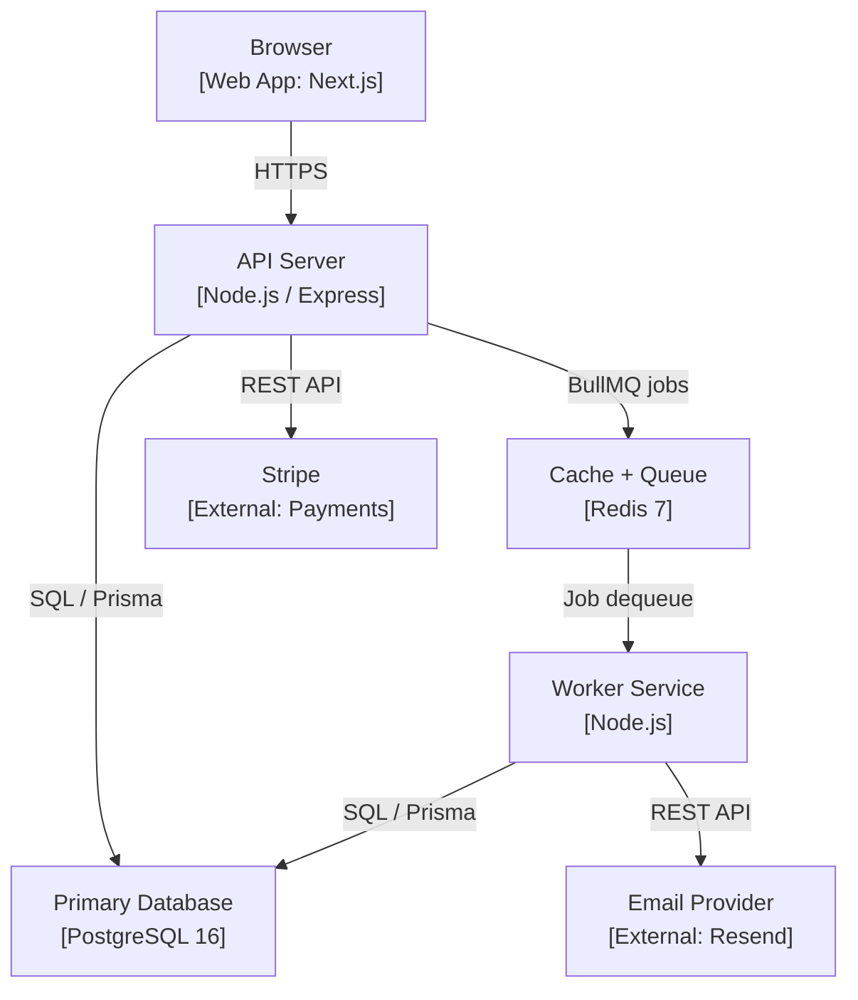

# Documentation Standards

**Version 1.0** · Last updated 17 April 2026

This document is a reference contract for how to write the docs that code alone can't carry. Local project rules, installed agent configs, and the actual documentation structure take precedence over examples here. It covers four artefacts: **ADRs** (why we decided things), **API documentation** (how the system's contract is expressed), **READMEs** (how you start a project), and **changelogs** (what changed and why).

This is a **companion** to `Architecture.md`, `Security.md`, `Code-Quality.md`, and `Performance.md`. Those docs tell you *how* to build. This one tells you how to *record* what you built so future-you and future-teammates can understand the choices without spelunking through git history.

> **See also:** [Architecture Guidelines](Architecture.md) — ADR process (§4 here cross-references §12 there), disaster recovery runbooks | [Security Guidelines](Security.md) — incident response docs, audit trail requirements | [Performance Guidelines](Performance.md) — SLO documentation, load test reports | [Code Quality Guidelines](Code-Quality.md) — inline code documentation standards

**Core stance:** undocumented decisions become re-debated decisions. Undocumented APIs become guessed-at APIs. Undocumented setup becomes a three-day onboarding. The cost of writing the doc once is always less than the accumulated cost of not writing it.

---

## Table of contents

1. [Principles](#1-principles)
2. [What to document, what not to](#2-what-to-document-what-not-to)
3. [Documentation structure per project](#3-documentation-structure-per-project)
4. [ADRs — Architecture Decision Records](#4-adrs--architecture-decision-records)
5. [API documentation](#5-api-documentation)
6. [README standards](#6-readme-standards)
7. [Changelogs](#7-changelogs)
8. [Semantic versioning](#8-semantic-versioning)
9. [Release notes](#9-release-notes)
10. [Internal documentation](#10-internal-documentation)
11. [Writing style](#11-writing-style)
12. [Maintenance](#12-maintenance)
13. [Anti-patterns](#13-anti-patterns)
14. [Per-project checklist](#14-per-project-checklist)
15. [Per-PR checklist](#15-per-pr-checklist)

---

## 1. Principles

Six principles, in priority order.

**1.1 Write for future strangers.** The reader is someone who knows nothing about your project, joining next month. They're competent. They're impatient. They don't have context. Every doc should make sense to them on first read. This also happens to be you in six months, having forgotten everything.

**1.2 Document decisions, not details.** The code shows *what*. Documentation shows *why*. "We chose Postgres over MongoDB because…" survives a decade; "we call `findById`" is obvious from reading the code and rots the moment the code changes.

**1.3 Keep it close to the thing.** README in the repo, not in internal wiki. API docs generated from the code, not maintained separately. ADRs (prefix `DECISION-`) at the project root, committed with the code change. Documentation that lives elsewhere drifts out of sync instantly.

**1.4 Make it easy to write.** Templates, checklists, generators. The lowest-friction path is the path that gets used. Nobody writes a doc they have to invent the structure of.

**1.5 Prefer less, better.** One well-maintained doc beats five stale ones. When in doubt, delete. Old docs that disagree with the code are worse than no docs — they actively mislead.

**1.6 Nothing is true unless it's in writing.** Verbal agreements get re-litigated. team chat threads scroll away. Meeting notes die. If a decision matters, it goes in a doc. If the doc doesn't exist, the decision didn't happen.

---

## 2. What to document, what not to

### 2.1 Document

- **Non-obvious decisions** — anything someone would reasonably ask "why did we do it this way?"
- **External contracts** — APIs, CLI interfaces, file formats, webhooks, queue messages
- **Setup and deployment** — how to run it locally, how to deploy, what env vars are needed
- **Domain concepts that aren't self-evident** — the vocabulary specific to your product, the business rules
- **Failure modes and recovery** — what can break, how to know it broke, how to fix it
- **Trade-offs taken** — what was considered, what was rejected, what the consequences are
- **The unobvious** — "this looks weird, here's why"

### 2.2 Don't document

- **Obvious code** — `// increment counter` above `counter++` is noise
- **Tutorials for the language or framework** — that's what the language's docs are for; link to them
- **Implementation details that should be read from code** — function signatures, class members
- **Things the code enforces** — types in TypeScript, Pydantic models in Python, database constraints
- **Meeting notes and team chat transcripts** — distil them into an ADR if they produced a decision; otherwise leave them
- **Anything you're likely to forget to update** — if it's not load-bearing, it'll rot and mislead

### 2.3 The staleness test

Before writing a doc, ask: "if this becomes wrong, will anyone notice?"

- If yes → write it carefully, own it, keep it fresh.
- If no → don't write it. Stale docs are worse than missing docs.

Signs a doc will go stale:
- It duplicates information from code or config
- It's "nice to have" rather than load-bearing
- No single person is responsible for it
- It describes current-state (not history / decisions)

---

## 3. Documentation structure per project

Every project has this top-level structure:

```
project/
├── README.md                    # Entry point, see §6
├── Architecture.md              # Foundation, standards
├── Security.md                  # Isolation, auth, encryption
├── DECISION-Modular-Monolith.md # Example ADR
├── Engineering-Workflow.md           # Process
└── ...
```

**Rules:**
- All documentation lives at the project root for maximum visibility to LLM agents and developers.
- No duplicate docs in internal wiki, internal wiki, or shared drive. Link to the repo from those tools if you need presence there.
- Every subdirectory in `` has a `README.md` explaining what it contains and linking to key files.
- Docs are markdown (`.md`), committed to the repo, reviewed via PR like code.

---

## 4. ADRs — Architecture Decision Records

An ADR is a short document that captures a single architectural decision: what was decided, why, what was considered, and what the consequences are.

### 4.1 When to write an ADR

Write one when a decision:

- **Is irreversible or expensive to reverse** — database choice, tenant model, auth strategy, primary language
- **Has ongoing consequences** — a pattern that code will be written against for years
- **Affects multiple teams or services** — cross-cutting conventions
- **Was genuinely contested** — two or more sensible options and you picked one
- **Will surprise someone later** — "why is it like this?" is likely

Don't write one for:

- Routine code choices — "we used a for loop" isn't an ADR
- Framework defaults — "we use the standard router" isn't an ADR
- Reversible experiments — try it, revert if bad, document only if it sticks

### 4.2 When to write it

**Before merging the code that implements the decision.** The ADR is part of the change, not after-the-fact narration. Write it as you're working through the choice; it becomes your own thinking aid and the team's permanent record.

If an ADR is discovered later (the decision predates the practice), write a retrospective one — mark it clearly as retrospective and date it both: when the decision was made and when it was documented.

### 4.3 ADR template

Every ADR follows this exact template. Copy and fill in.

```markdown
# [Short Title]: <Short title in active voice>

**Date**: YYYY-MM-DD
**Status**: Proposed | Accepted | Deprecated | Superseded by DECISION-New-Title
**Deciders**: <names or roles>
**Tags**: <domain, area, e.g. "database, multi-tenancy">

## Context

What problem are we solving? What constraints apply? What forces are in play?
2-4 paragraphs. Describe the situation someone walking in cold would need
to understand to make sense of the decision.

## Decision

What we are doing. One or two paragraphs. Active voice. Decisive.

## Alternatives considered

### Option A: <name>
Short description. Pros. Cons. Why not.

### Option B: <name>
Short description. Pros. Cons. Why not.

(Usually 2-4 alternatives. One-option ADRs are suspicious — you didn't think hard enough.)

## Consequences

### Positive
- What becomes easier / better / possible

### Negative
- What becomes harder / worse / constrained

### Neutral / to watch
- Things we'll need to revisit
- Conditions that would invalidate this decision

## Implementation notes

Optional. Pointers to the code, configuration, migrations that embody this decision.

## References

- Links to related ADRs
- Links to external resources that informed the decision
- Links to the ticket / issue that prompted it
```

### 4.4 ADR worked example

```markdown
# DECISION-Use-ULIDs: Use ULIDs for primary keys

**Date**: 2026-04-10
**Status**: Accepted
**Deciders**: Engineering
**Tags**: database, ids, conventions

## Context

We need a primary key strategy for every application table. The product is
multi-tenant B2B SaaS targeting 10k+ users. IDs appear in URLs, API responses,
logs, and debugging output. They need to be:

- Globally unique across tables (to support cross-module references without collision)
- Safe to expose in URLs (no sensitive information leaked)
- Efficient as a DB index (good locality, fixed size)
- Sortable by creation time (useful for pagination and debugging)

## Decision

All primary keys are ULIDs (26-character Crockford base32, 128 bits of entropy,
timestamp-prefix for sort order). Generated at the application layer.

## Alternatives considered

### Option A: Auto-increment integers
Pros: compact, fast, native to most databases.
Cons: leak row count and growth rate to anyone reading URLs; enable enumeration
attacks; don't work across sharded systems.

### Option B: UUIDs v4
Pros: globally unique, non-sequential, universally supported.
Cons: not sortable by creation time; poor index locality in B-tree indexes;
36 characters with hyphens (ugly in URLs).

### Option C: UUIDs v7 (time-ordered UUIDs)
Pros: combines UUID uniqueness with time ordering.
Cons: only draft-standardised at decision time; library support inconsistent;
36 characters still.

### Option D: ULIDs
Pros: time-ordered, 128-bit unique, 26 chars in URL-safe base32.
Cons: less universally recognised than UUID; requires a library (trivial).

## Consequences

### Positive
- Cursor pagination is straightforward (ULIDs sort naturally)
- Logs are chronologically readable
- No row-count leakage through IDs
- Cross-table FK references are unambiguous

### Negative
- Small overhead vs integers in index size (26 chars vs 8 bytes)
- Team has to know what a ULID is

### Neutral / to watch
- If we ever shard, ULIDs still work but time-ordered locality reduces
- Revisit if UUIDv7 gains broad ecosystem support

## Implementation notes

- Prisma generator: `@default(ulid())` via `ulid` generator plugin
- TypeScript type alias in `shared/types/ids.ts`
- Validation regex: `/^[0-9A-HJKMNP-TV-Z]{26}$/`

## References

- DECISION-Tenant-Isolation: Tenant isolation model
- https://github.com/ulid/spec
```

### 4.5 ADR lifecycle

ADRs are immutable history. Once an ADR is marked as **Accepted**, you don't edit its content — you write a new one if you change your mind.

Never delete an ADR. If you change your mind later, write a new ADR with `Supersedes DECISION-Old-Title` in its status, and update the old ADR's status to `Superseded by DECISION-New-Title`.

Filenames: `DECISION-Kebab-Case-Title.md`.

### 4.6 ADR status values

- **Proposed** — draft, under discussion
- **Accepted** — decided, in effect
- **Deprecated** — no longer recommended, but still in use somewhere
- **Superseded by DECISION-XXXX** — replaced by a newer decision

An ADR's status changes over its life. When you supersede one, update the old ADR's status line; don't delete it. ADRs are immutable in content but mutable in status.

### 4.7 ADR index
The root directory acts as the index for LLM agents. For humans, keep a summary in the project README or a dedicated `DECISION-Index.md` (optional).

### 4.8 Verification

### 4.8 ADRs vs RFCs vs Design Docs

Sometimes these get confused. The distinctions:

- **ADR** — records a decision that has been made (or is being made). Past-to-present tense. Short (1-3 pages).
- **RFC** (Request for Comments) — proposes a change for discussion. Future tense. Longer, with more detail on implementation.
- **Design doc** — detailed plan for building something substantial. Often living, updated as the work progresses.

For most projects, ADRs alone are enough. Large projects add RFCs for major changes; design docs for significant features. Don't adopt three processes when one will do.

---

## System diagrams — C4 model

All architecture diagrams follow the **C4 model** (Context → Containers → Components → Code). This gives everyone a shared vocabulary and prevents diagrams that are either too abstract to be useful or too detailed to be understood.

### The four levels

**Level 1 — System Context (required for every project)**
Who uses the system and what external systems does it integrate with? This is the "30,000 ft view". Audience: anyone, including non-technical stakeholders.

```
┌─────────────────────────────────────────────────────┐
│                    System Context                   │
│                                                     │
│  [User: Admin] ──→ ┌──────────────┐ ──→ [Stripe]   │
│  [User: Member] ──→│  Your App    │ ──→ [Email API] │
│                    └──────────────┘ ──→ [AI API]    │
└─────────────────────────────────────────────────────┘
```

**Level 2 — Container diagram (required)**
What are the deployable units? Web app, API, database, job queue, CDN. This is the diagram engineers use day-to-day.

```
┌────────────────── Your App ─────────────────────────┐
│                                                     │
│  [Browser] → [Next.js Frontend]                     │
│                      ↓                              │
│             [Node.js API Server]                    │
│              ↙          ↘                           │
│    [Postgres DB]    [Redis / BullMQ]                │
│                          ↓                          │
│                  [Worker Service]                   │
└─────────────────────────────────────────────────────┘
```

**Level 3 — Component diagram (required for complex modules only)**
What are the major components inside a single container? Use for: the API server's internal modules, the worker service's job types. Skip for simple containers.

**Level 4 — Code diagram (almost never needed)**
Class/function relationships. Git and IDE navigation handle this better than a diagram.

### What to maintain

| Diagram | Level | Update trigger | Tool |
|---|---|---|---|
| System context | L1 | New external integration | Mermaid or draw.io |
| Container diagram | L2 | New service or database | Mermaid or draw.io |
| Module component map | L3 | Major refactor of a core module | Mermaid or draw.io |

**Recommended tool: Mermaid** — diagrams live as code in the repository, diff with git, render automatically in GitHub and most wikis. No diagramming tool account required.

### Mermaid template — container diagram



### Staleness rule

A diagram is stale if it does not match the current container topology. The staleness test (§2.3 of this document) applies to diagrams too: can a new engineer follow this diagram and deploy a working local environment? If not, update the diagram before merging.

### Where diagrams live

- `ARCHITECTURE-context.md` — Level 1 context diagram
- `ARCHITECTURE-containers.md` — Level 2 container diagram + deployment notes
- `ARCHITECTURE-modules/` — Level 3 component diagrams, one per complex module
- Each ADR may include a before/after diagram if the decision changes the architecture

---

## 5. API documentation

Every API (HTTP, GraphQL, CLI, SDK) needs documentation. If external clients (internal teams, customers, partners) will call it, doc quality is a first-class product feature — bad API docs drive people to competitors.

### 5.1 Source of truth: the spec file

For HTTP APIs: **OpenAPI 3.1** (formerly Swagger). Generated from the code where possible; hand-maintained where not. Stored in the repo at `API-openapi.yaml` or `API-openapi.json`.

For GraphQL: the schema file itself is the spec. Add descriptions to every type and field via schema comments.

For CLIs: `--help` output, plus a `API-cli.md` reference.

For SDKs: inline doc comments in the source, generating to typed stubs that users' IDEs pick up automatically.

### 5.2 OpenAPI generation approaches

Pick one approach per project and commit:

**Code-first** — decorators / types on the routes generate the spec.
- Node: `zod-to-openapi`, `express-openapi`, `fastify`'s schema, NestJS's `@nestjs/swagger`
- Python: FastAPI generates spec automatically from type hints
- Pro: spec is always in sync with code
- Con: decorator noise, limited expressiveness

**Spec-first** — write OpenAPI YAML by hand, generate server stubs and client SDKs from it.
- Tools: `openapi-generator`, `orval`
- Pro: spec is the contract, code implements it
- Con: more ceremony, requires discipline to keep in sync

**Hybrid** — schemas from code, spec metadata from YAML.
- Works well with Zod + `zod-to-openapi`
- Best of both for most projects

Pick code-first as the default unless you have multiple consumers needing strong contracts up front.

### 5.3 What every endpoint documents

- **Path and method** — obvious, but documented
- **Summary** — one line, verb phrase: "List records", "Verify a record"
- **Description** — 1-3 sentences of context. When would you call this? What happens?
- **Parameters** — every query, path, header parameter: name, type, required, description, example
- **Request body** — schema with every field typed and described
- **Responses** — every status code the endpoint can return, with response schema per code
- **Errors** — what `code` values in the error envelope this endpoint can emit
- **Authentication** — which scheme applies (session, API key, OAuth, public)
- **Rate limits** — per-second / per-hour caps if non-default
- **Idempotency** — whether the endpoint is idempotent, supports `Idempotency-Key`
- **Examples** — at least one successful request/response, one error

### 5.4 OpenAPI example

```yaml
paths:
  /api/v1/records/{recordId}:
    get:
      operationId: getRecord
      summary: Get a record
      description: |
        Retrieves a record by its ULID. The record must belong to the
        authenticated tenant; otherwise the endpoint returns 404 (never 403,
        to prevent existence-leak).
      tags: [records]
      security:
        - sessionAuth: []
        - apiKeyAuth: [record.read]
      parameters:
        - name: recordId
          in: path
          required: true
          description: The ULID of the record
          schema:
            type: string
            pattern: '^[0-9A-HJKMNP-TV-Z]{26}$'
          example: '01HXYZABCDEFGHJKMNPQRSTVWX'
      responses:
        '200':
          description: The record was found and returned
          content:
            application/json:
              schema:
                $ref: '#/components/schemas/Record'
              examples:
                verified:
                  value:
                    id: '01HXYZABCDEFGHJKMNPQRSTVWX'
                    name: 'Acme Project'
                    status: 'verified'
                    createdAt: '2026-01-15T10:30:00.000Z'
        '404':
          description: Not found (or not accessible to this caller)
          content:
            application/json:
              schema:
                $ref: '#/components/schemas/ErrorEnvelope'
              examples:
                notFound:
                  value:
                    error:
                      code: 'NOT_FOUND'
                      message: 'Record 01HXYZ... not found'
                      correlationId: '01HQKR0E7C8K3TD9S2FP6NB4VA'
        '401':
          $ref: '#/components/responses/Unauthorized'
        '429':
          $ref: '#/components/responses/RateLimited'
```

### 5.5 Error documentation

The error envelope is standard (see architecture §5.5). The list of possible `code` values per endpoint is not — document them explicitly.

```markdown
## Error codes for /api/v1/records

| Code | Status | Meaning | Endpoint |
|---|---|---|---|
| `RECORD_NOT_FOUND` | 404 | Record doesn't exist or caller has no access | GET, PATCH, DELETE |
| `RECORD_INVALID_STATUS_TRANSITION` | 409 | Can't change status from current to requested | PATCH /status |
| `RECORD_REFERENCE_DUPLICATE` | 409 | A record already exists with this reference number | POST |
| `RECORD_VALIDATION_FAILED` | 400 | Request body failed validation | POST, PATCH |
```

### 5.6 Deprecation and sunsetting

When deprecating an endpoint or version:

1. Mark it in OpenAPI: `deprecated: true` with a `description` explaining the migration path
2. Return HTTP headers: `Deprecation: true`, `Sunset: <RFC 1123 date>`, `Link: <migration guide>; rel="successor-version"`
3. Note in the changelog with "Deprecated" heading
4. Communicate to known consumers

See architecture §5.11 for the full breaking-change protocol.

### 5.7 API reference site

Render the OpenAPI spec to a browsable reference:

- **Scalar** — modern, fast, minimal, open-source
- **Redoc** — mature, customisable
- **Stoplight Elements** — feature-rich
- **Swagger UI** — classic, interactive "try it out"

Host at a stable URL (`https://api.example.com/docs` or `https://docs.example.com/api`). Regenerate on every deploy so the docs match production.

### 5.8 SDK and client generation

If you publish client SDKs, generate them from the OpenAPI spec — don't hand-write them, they drift immediately.

Tools:
- **OpenAPI Generator** — many languages, opinionated output
- **Orval** (TypeScript) — generates React Query hooks directly
- **Heyapi** — newer, actively maintained TypeScript generator

Publish SDKs versioned alongside the API. SDK v2 pairs with API v2.

### 5.9 Webhook documentation

Webhooks are APIs that you call (outbound). Document them with equal rigour:

- Event name and version
- Payload schema
- Signing mechanism (see security §5.7)
- Retry behaviour (how often, max attempts)
- Example payload
- How to verify signature (with code in common languages)

### 5.10 Changelog for the API

API changes get their own section in the main changelog OR a separate `API-CHANGELOG.md`. Mark every change as:

- **Breaking** — requires a new API version
- **Additive** — new endpoint, new optional field, new status code
- **Deprecation** — still works, but going away by date X

---

## 6. README standards

The README is the front door. If it's bad, people bounce. Most open-source projects live or die on README quality; internal projects have the same truth, just with captive users.

### 6.1 The README template

Every project has a README with these sections, in this order:

```markdown
# Project Name

One-sentence description. What does this project do, for whom.

[![CI status]] [![Coverage]] [![Latest release]]  <!-- optional badges -->

## Quick start

The 3-5 commands to go from `git clone` to running locally. If someone can't
run your project in 5 minutes, this section is broken.

## What it is

2-4 paragraphs. The pitch. Who uses it, what problem it solves, what it is
not. Include a screenshot or demo gif if the project has a UI.

## How it works

High-level architecture. 1-2 paragraphs plus maybe a diagram. Pointers to
more detailed docs in `architecture.md`.

## Requirements

- Node 20+ / Python 3.12+ / whatever
- Postgres 16
- Redis 7
- any external accounts / API keys needed

## Setup

Step-by-step setup for local development. Include:
- Cloning
- Installing dependencies
- Setting up environment variables (with pointer to `.env.example`)
- Running the database / services
- Running the app

## Usage

The most common things a user / developer does:
- How to call the API (or use the CLI, or open the UI)
- How to run tests
- How to run linter
- How to build for production

## Project structure

High-level directory overview. Key files and what they do.

## Configuration

Environment variables reference. What each one does, what values it accepts,
whether it's required.

## Contributing

Link to CONTRIBUTING.md, or inline for small projects:
- Branch naming
- Commit message format
- How to open a PR
- Code of conduct

## License

SPDX identifier and link to LICENSE file.
```

### 6.2 README rules

- **Keep it under 500 lines.** Longer READMEs aren't read. Link to deeper docs in ``.
- **Start with the pitch, not the history.** Nobody cares how you got here on first read.
- **Code blocks with copy-paste-ready commands.** Never pseudocode.
- **Assume the reader is competent.** Don't explain git. Do explain project-specific conventions.
- **Keep it current.** README rot is the loudest signal of project rot. Update when things change; CI can check that commands in the Quick Start section actually work.

### 6.3 Quick Start test

The single most important part of a README. Test it regularly.

Process: have someone unfamiliar with the project follow the Quick Start from scratch on a clean machine. Time them. Note where they get stuck. Fix those steps. Repeat every 6 months.

If the process takes more than 10 minutes, the Quick Start is broken.

### 6.4 Screenshots and diagrams

For UI projects: include 1-3 screenshots in the README. Current, not aspirational.

For system projects: one simple architecture diagram. Use:
- **Mermaid** — renders on GitHub, diagrams-as-code
- **PlantUML** — similar
- **Excalidraw** — export as SVG, commit the file

Don't commit PNG screenshots produced by a tool no one on the team has. Keep diagrams editable.

### 6.5 Badges

Useful if used sparingly (≤ 5): CI status, latest release, coverage, license. Badges above this become decoration and noise.

```markdown


```

### 6.6 When the project is part of a larger repo

Monorepos have a root README *and* per-package READMEs. The root README:
- Describes the whole repo
- Lists packages with one-line descriptions
- Quick Start for the common case (run everything locally)

Each package's README:
- Describes just that package
- Quick Start for that package alone
- Package-specific configuration

Don't duplicate content. Link.

---

## 7. Changelogs

A changelog is the record of what changed in each release, written for humans. It's not the git log, it's not the commit history, it's not the release tag. It's a curated, human-readable summary.

### 7.1 Keep a Changelog format

Use the `keepachangelog.com` format. It's the de facto standard, parsers exist for it, humans read it naturally.

```markdown
# Changelog

All notable changes to this project will be documented in this file.

The format is based on [Keep a Changelog](https://keepachangelog.com/en/1.1.0/),
and this project adheres to [Semantic Versioning](https://semver.org/spec/v2.0.0.html).

## [Unreleased]

### Added
- Record attachment verification endpoint
- Admin comparison card showing summary averages

### Changed
- Record scoring algorithm now uses weighted criteria (DECISION-Scoring-Algorithm)

### Deprecated
- `/api/v1/records/search` — use `/api/v1/records?q=` instead

### Removed
- Legacy CSV export (replaced by the export API in v2.3)

### Fixed
- Fixed session cookie not respecting `SameSite` in Safari 16
- Fixed N+1 query in record list endpoint

### Security
- Upgraded bcrypt to argon2id for new password hashes (DECISION-Argon2id)
- Patched dependency CVE-2026-12345 in `example-lib`

## [2.4.0] — 2026-04-10

### Added
- ...
```

### 7.2 Section headings

Exactly these six, in this order, when they apply. Omit empty sections.

- **Added** — new features
- **Changed** — changes to existing functionality
- **Deprecated** — soon-to-be-removed features
- **Removed** — features removed in this release
- **Fixed** — bug fixes
- **Security** — vulnerabilities patched, security improvements

Don't invent new sections. Consistency makes the changelog scannable.

### 7.3 Entry format

One line per change, imperative mood, ending in a reference if applicable.

```markdown
### Added
- Bulk verification endpoint `POST /api/v1/records/bulk-verify` (#142)
- Support for additional attachment types alongside existing formats (#156)

### Fixed
- Fixed rate-limit counter drift under high concurrency (#178, DECISION-Rate-Limit-Fix)
- Fixed soft-delete cascade missing on nested task invitations
```

**Rules:**
- Start with a verb: "Added", "Fixed", "Changed" — but in the entries, continue imperative: "Add X", "Fix Y", "Support Z"
- Reference the issue / PR / ADR in parens at the end
- Link to ADRs by identifier, not URL — the reader clicks through to the ADR index
- Group related entries; don't interleave unrelated changes

### 7.4 What gets a changelog entry

Every user-visible change. If a user (end user, API consumer, operator, fellow developer) would care, it's an entry.

**Yes:**
- New features
- Changes to behaviour of existing features
- Bug fixes visible to users
- API changes (any)
- Configuration changes (new env vars, changed defaults)
- Performance improvements users would notice
- Security patches
- Breaking changes (always, and always at the top)

**No:**
- Internal refactors with no behaviour change
- Code style changes
- Test-only changes
- CI / tooling changes that don't affect developers
- Dependency bumps with no user-visible effect

The heuristic: if a user would ask "why does this behave differently now?", it goes in the changelog.

### 7.5 Breaking changes

Breaking changes are non-negotiable changelog entries — users **will** miss them if buried. Rules:

- Call them out with a `### ⚠️ Breaking changes` heading first in the section
- Describe exactly what broke and the migration path
- Link to a migration guide if non-trivial

```markdown
## [3.0.0] — 2026-05-01

### ⚠️ Breaking changes
- **API v1 removed.** `/api/v1/*` endpoints now return 410 Gone. Migrate to v2.
  See the migration guide for the relevant version pair, for example `MIGRATION-v1-to-v2.md`.
- **Minimum Node version now 20.** Support for Node 18 dropped. Update your
  Dockerfile and CI config.
- **`record.contactEmail` field removed**, replaced by `record.contacts[]`
  array. Existing single-email usage migrates automatically on read; writes
  require new format.

### Added
- Multi-contact support per record
- ...
```

### 7.6 When to update the changelog

**In the PR that introduces the change.** Not "at release time, someone will write it". By release time, nobody remembers what they shipped 6 weeks ago.

PR template includes a checklist item: "Changelog updated (Unreleased section)". CI can verify that `CHANGELOG.md` has been touched for non-trivial PRs — but human judgment calls what's notable.

### 7.7 Release process

On release:

1. Move everything under `[Unreleased]` into a new section `[X.Y.Z] — YYYY-MM-DD`
2. Keep `[Unreleased]` as an empty heading for future work
3. Create a git tag matching the version (`vX.Y.Z`)
4. Optionally: create a GitHub / GitLab release with the changelog section as the release notes

### 7.8 Machine-readable changelog

For projects that want automation, use `conventional-commits` to auto-generate changelog entries from commit messages. Tools:

- `standard-version`
- `semantic-release`
- `changesets` (monorepo-aware)

Tradeoff: less curation, more automation. For small fast-moving projects, automation wins. For products with external communication (SaaS, SDKs), hand-curate — commits aren't written for changelog consumers.

---

## 8. Semantic versioning

Every release gets a version number. The number is structured, not arbitrary.

### 8.1 The semver contract

Format: `MAJOR.MINOR.PATCH` — e.g. `2.4.1`.

- **MAJOR** — incompatible API changes. Anything that breaks existing clients.
- **MINOR** — new functionality, backwards-compatible. Existing clients keep working.
- **PATCH** — backwards-compatible bug fixes. No new functionality.

Examples:
- Add a new optional field to a response → MINOR
- Add a new endpoint → MINOR
- Fix a bug in an existing endpoint → PATCH
- Remove a field from a response → MAJOR
- Change a field's type → MAJOR
- Internal refactor, no behaviour change → no version bump (or PATCH if you must release)

### 8.2 Pre-release and build metadata

For pre-release versions:

- `2.4.0-alpha.1` — early, unstable
- `2.4.0-beta.2` — feature-complete, testing
- `2.4.0-rc.1` — release candidate
- `2.4.0` — released

Build metadata after `+`: `2.4.0+20260417`. Not usually needed for application versioning.

### 8.3 Versioning apps vs libraries

**Libraries** — strict semver. Breaking changes are expensive for consumers; communicate them through the version number.

**Applications** — semver is a weaker contract, but still useful. MAJOR for database migrations that require downtime, MINOR for notable feature releases, PATCH for bug fixes.

**Monorepos** — independent versioning per package (Changesets-style) or single version for everything (Lerna's fixed mode). Pick one per repo; mixing confuses.

### 8.4 What counts as "public API"

For semver purposes, the public API is:

- **HTTP/GraphQL endpoints** — URL, method, parameters, response shape, status codes, error codes
- **SDK exports** — public functions, types, classes
- **CLI** — commands, flags, output formats
- **Webhooks** — event names, payload shapes, signing
- **Config** — env vars, config file formats, defaults

Not the public API:
- Internal modules not exported from the SDK
- Database schema (has its own migration discipline)
- Log formats (unless you've committed to them)
- Implementation details

Document what is and isn't public API in the README. Semver only means something if "what breaks" is shared knowledge.

### 8.5 Zero-version (`0.x.y`)

Pre-1.0 versions have relaxed semver: anything can change at any time. In practice:

- Use `0.x.y` for early projects where the API isn't settled
- Treat `MINOR` bumps as potentially breaking
- Graduate to `1.0.0` when you commit to a stable API

Don't live in 0.x forever. Projects at 0.47 are signalling they don't want to commit — which signals "don't depend on us". Pick a version the API is stable at and graduate.

---

## 9. Release notes

Release notes are the public-facing, user-oriented version of a changelog entry. Where the changelog is technical and exhaustive, release notes are curated and narrative.

### 9.1 When you need them

- Product with end users → always (for each user-facing release)
- Public SDK / API → always
- Internal library → changelog alone is enough

### 9.2 Structure

```markdown
# Release 2.4.0 — 10 April 2026

## Highlights

What's the headline? 1-3 bullet points of the most impactful changes. Users
read this and nothing else; make it count.

## What's new

- **Big feature name** — one paragraph explaining what it is, who it's for,
  why it matters. Screenshot if applicable. Link to docs for more.
- **Smaller feature** — one sentence to one paragraph.

## Improvements

- Faster record list load (30% faster at p95)
- Cleaner error messages when reference number is invalid
- ...

## Bug fixes

Reference the changelog's Fixed section; don't duplicate extensively.

## Breaking changes

If any. Be loud. Link to migration guide.

## Deprecated

If any.
```

### 9.3 Tone

Release notes are marketing-adjacent. Write them in product voice:

- Users are the subject, not the system: "You can now…" not "The system now supports…"
- Describe outcomes, not implementation: "Faster onboarding" not "Refactored registration flow"
- Link generously: to docs, to the upgraded feature's UI, to the migration guide
- Keep it readable — most users scan, few read fully

### 9.4 Where they live

- In the repo: `RELEASE-X.Y.Z.md`
- On the website / in-app: product blog, changelog page, in-app "What's new" banner
- Email: release-notes email to subscribers

One source, many destinations. Don't hand-write the same content in multiple places.

---

## 10. Internal documentation

Covering the rest of ``: runbooks, guides, architecture overview.

### 10.1 Architecture overview (`architecture.md`)

A 1-2 page snapshot of the system. Not a replacement for ADRs — a snapshot of current state that ADRs produced.

Contents:
- High-level diagram (services, data flow)
- Core abstractions (tenants, users, key domain entities)
- Key ADRs (links)
- Where to find more: code paths, runbooks, ADRs

Update when structure changes significantly. Review quarterly.

### 10.2 Runbooks (`RUNBOOK-`)

Step-by-step instructions for operational tasks. Written for someone at 3am who may not know the system deeply.

One runbook per task:
- `database-restore.md` — how to restore from backup
- `rotating-secrets.md` — how to rotate API keys / tokens
- `handling-incident.md` — general incident response
- `cert-renewal.md` — TLS certificate renewal process
- `tenant-offboarding.md` — how to fully offboard a customer

Runbook template:

```markdown
# Runbook: <task name>

**Owner**: <team or role>
**Last tested**: YYYY-MM-DD
**Severity**: Low | Medium | High | Critical

## When to use this

Conditions or alerts that trigger this runbook.

## Prerequisites

- Access you need (credentials, VPN, etc.)
- Tools required
- Notifications to send before starting

## Steps

1. **Step 1** — precise command or action
   ```bash
   # exact command
   ```
   Expected output / confirmation.

2. **Step 2** — ...

## Verification

How to confirm the task completed successfully.

## Rollback

If the task goes wrong, how to undo it.

## Escalation

Who to page / call if you're stuck.
```

**Rules:**
- Test runbooks quarterly. Untested runbooks are fiction.
- Update them after any real incident that exercised them — the lived experience always reveals gaps.
- Every step has a concrete command or action, no "figure out".

### 10.3 Guides (`guides/`)

Task-focused how-tos for developers:
- `local-setup.md` — deeper than README Quick Start
- `adding-a-feature.md` — from idea to merged PR
- `debugging-tenant-issues.md` — how to diagnose a reported bug
- `running-migrations.md` — the migration process, expanded

Guides are longer than runbooks but less formal. Narrative, not just steps.

---

## 11. Writing style

Documentation is writing. Apply writing craft.

### 11.1 Voice and tense

- **Active voice.** "The worker processes the job" not "The job is processed by the worker".
- **Present tense for current state.** "The system validates the request." not "The system will validate…"
- **Imperative for instructions.** "Run `npm install`." not "You should run npm install."
- **Past tense for history and ADRs.** "We chose Postgres because…"

### 11.2 Tone

- **Direct.** Say the thing. "This is broken" beats "It appears there may be an issue".
- **Professional, not corporate.** Plain English. Assume the reader is competent.
- **No hype.** "This feature is powerful" — if it's powerful, the description will show that. Adjectives are a tell.

### 11.3 Structure

- **One idea per paragraph.** 2-5 sentences. Break long paragraphs.
- **Headings describe content.** "Installation" not "How to install". Be scannable.
- **Lists for things that are actually lists.** 3+ items that are parallel. Not "I want to use a list here because it looks cleaner".
- **Tables for comparisons.** When items have parallel attributes, table them. Prose gets cluttered.

### 11.4 Code examples

Every code example should:
- **Be copy-paste runnable** (or clearly marked as pseudo-code)
- **Have language highlighting** (`typescript`, `python`, `bash`)
- **Be minimal.** Show the thing you're demonstrating; cut everything else.
- **Use realistic names.** `recordId` not `someId`. Avoids the "what's this represent?" pause.

Bad:
```ts
const x = await foo(y);
```

Good:
```ts
const record = await db.record.findUnique({ where: { id: recordId } });
```

### 11.5 Links

- **Link the first mention** of an external concept. Subsequent mentions don't need a link.
- **Use descriptive link text.** "See the tenant isolation ADR (`DECISION-Tenant-Isolation.md`)" not "see here".
- **Link to specific sections**, not whole pages, when pointing at a single idea (`#section-id`).
- **Avoid "click here".**

### 11.6 Common words and phrases to cut

- **"Simply"** — if it were simple, you wouldn't be explaining it
- **"Just"** — usually minimises what the reader faces
- **"Obviously"** — if it were obvious, the doc wouldn't exist
- **"Easy"** — claim earned, not declared
- **"Note that"** — usually removable; if the note is important, put it in a callout
- **"Please"** — in instructions, reads as pleading

### 11.7 Callouts

Use these to surface important info without hiding it in prose:

```markdown
> **Note**: This behaviour differs from v1. See the migration guide.

> **Warning**: This operation cannot be undone.

> **Security**: This endpoint requires admin role. See §3.
```

Don't overuse. If everything is a callout, nothing is.

### 11.8 Diagrams

Preferred tools:
- **Mermaid** — text-based, renders on GitHub and most docs platforms
- **PlantUML** — similar, more features
- **Excalidraw** — for looser sketches; commit the `.excalidraw` source alongside the PNG export
- **Miro / design tool** — for rich diagrams, but export and commit the image

Diagrams go out of date faster than code. Only create them when they add genuine clarity. A small, current diagram beats an elaborate, stale one.

---

## 12. Maintenance

Docs rot. Without maintenance, the whole system loses trust — once one doc is wrong, readers stop trusting any doc.

### 12.1 Ownership

Every doc has an owner (a team, a role, a person). The owner is responsible for keeping it current. Encode it in the doc's frontmatter:

```markdown
---
owner: platform-team
last-reviewed: 2026-04-01
---
```

### 12.2 Review cadence

| Doc type | Review cadence |
|---|---|
| README | Quarterly + when Quick Start changes |
| Architecture overview | Quarterly |
| ADRs | Never (immutable) — but status changes anytime |
| API reference | Automated from code; manual review of quality quarterly |
| Runbooks | Quarterly + after every real use |
| Guides | Bi-annually |
| Changelog | Per-release |

Put the review in a calendar. Unscheduled reviews never happen.

### 12.3 Deletion

Delete aggressively. A wrong doc is worse than no doc.

- If it's not useful, delete.
- If it's outdated and no one will fix it, delete.
- If it duplicates another doc, delete the duplicate.

Git remembers. If you need it back, `git log` finds it.

### 12.4 CI enforcement

- Links checked (`lychee` or `markdown-link-check`) on CI
- Spelling checked (`cspell`) if you're picky
- Code blocks in docs compile / run (`doctest`-style for Python, markdown snippet tests for TS)
- Quick Start commands tested (e.g., `make doc-test`)

Don't build an elaborate pipeline upfront. Add one check at a time, each triggered by a real incident of drift.

### 12.5 Docs-as-code

Documentation follows the same process as code:

- Written in markdown
- Committed to the repo
- Reviewed via PR
- Merged through standard workflow
- Deployed / rendered automatically

"Docs as code" isn't a fancy stack — it's treating docs with the same seriousness as code.

---

## 13. Anti-patterns

Doc practices that look responsible and aren't.

### 13.1 The wiki graveyard

Symptom: a company internal wiki / internal wiki with hundreds of pages, 80% outdated, 10% wrong, 10% useful. Nobody knows which is which.

Reality: centralised wikis encourage quantity over quality. Prefer docs in the repo, owned by the team that owns the code.

### 13.2 The "we'll document it later" release

Symptom: feature ships, docs come in a follow-up PR "next week". Next week never comes.

Reality: docs ship with the code or not at all. PRs require the changelog entry, the ADR (if applicable), and the updated README / API doc as part of the same merge.

### 13.3 The 47-page README

Symptom: README that tries to be everything — pitch, docs, contribution guide, tutorials, API reference.

Reality: READMEs are front doors, not entire houses. Keep under 500 lines. Link to deeper docs.

### 13.4 The meeting-notes-as-documentation pipeline

Symptom: "I wrote it up in the design review doc." Decisions buried in 30-page meeting transcripts nobody reads.

Reality: distil decisions into an ADR. The meeting notes can die; the ADR survives.

### 13.5 The "let's just use the code comments" stance

Symptom: pushing back on doc writing because "good code doesn't need docs".

Reality: code shows what. Docs explain why. They don't replace each other. Neither is sufficient alone.

### 13.6 The stale runbook

Symptom: runbook written in 2023, never tested, paged on at 3am, doesn't work.

Reality: untested runbooks are fiction. Test quarterly. Rotate who tests so knowledge spreads.

### 13.7 Documentation as performance

Symptom: lavish docs for features nobody uses. Zero docs for the features everyone uses.

Reality: docs follow usage, not author vanity. Document what matters to users.

### 13.8 The ADR log nobody reads

Symptom: hundreds of ADRs, indexed, filed, never referenced.

Reality: ADRs are for future questions ("why is it like this?"). If they're not being linked to from PR reviews, runbooks, and onboarding docs, they're not doing their job. Link them; cite them.

### 13.9 The API doc that says what the code says

Symptom: API docs autogenerated with zero descriptions. Every endpoint is "Get record" with no explanation of when to call it, what it returns in edge cases, what the error codes mean.

Reality: autogeneration gives you shape. Humans fill in the *why*. Descriptions, examples, error docs, usage notes — those are the doc.

### 13.10 The heroic CHANGELOG entry on release day

Symptom: "Let's write the changelog for this release" → someone reads all 87 PRs merged since last release → takes half a day → shipped changelog is bland and misses context.

Reality: update as you go. Every PR touches `CHANGELOG.md`. Release is a matter of moving `[Unreleased]` to a versioned heading.

---

## 14. Per-project checklist

For every new project:

### Structure
- [ ] `README.md` exists and passes Quick Start test
- [ ] `LICENSE` file present
- [ ] `CHANGELOG.md` exists (even if just `[Unreleased]` section)
- [ ] `` directory structured as §3
- [ ] `.github/PULL_REQUEST_TEMPLATE.md` exists with checklist references

### Ownership
- [ ] Every doc has an owner (frontmatter or index)
- [ ] Review cadence set in the team's calendar

### Automation
- [ ] Link checking in CI
- [ ] README Quick Start tested in CI where feasible
- [ ] API docs generate on every merge to main
- [ ] Changelog entry required in PR template

### Substantive
- [ ] Architecture overview written
- [ ] First ADRs for foundational decisions written
- [ ] At least one runbook for the most common operational task
- [ ] API documentation published (if API exposed)
- [ ] Release process documented

---

## 15. Per-PR checklist

For every non-trivial PR:

### Documentation changes
- [ ] `CHANGELOG.md` updated under `[Unreleased]`
- [ ] README updated if setup / usage / config changed
- [ ] API docs updated if endpoints changed (or verified auto-gen is correct)
- [ ] Runbook updated if operational behaviour changed

### ADR
- [ ] ADR written if this PR implements a significant architectural decision
- [ ] ADR status updated if this PR supersedes a previous decision

### Quality
- [ ] Links in new/changed docs resolve
- [ ] Code examples are current and runnable
- [ ] New docs follow the writing style (§11)
- [ ] No stale information introduced

If every box is ticked: ready to merge. If any are unticked: fix before requesting review.

---

*End of document. Changes require a version bump in the header. Documentation standards are reviewed annually — the doc evolves with the team's practice.*
